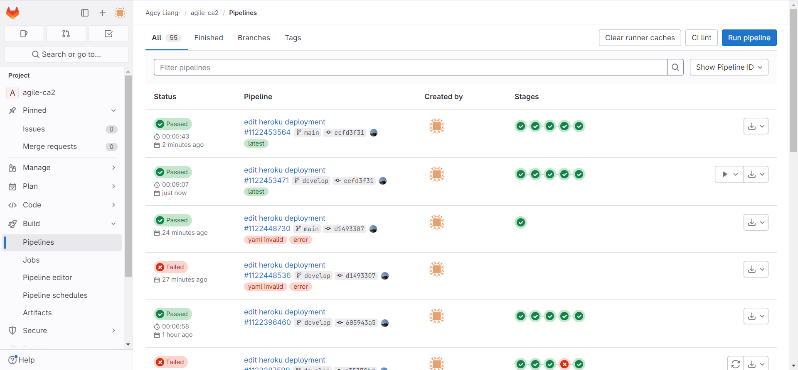
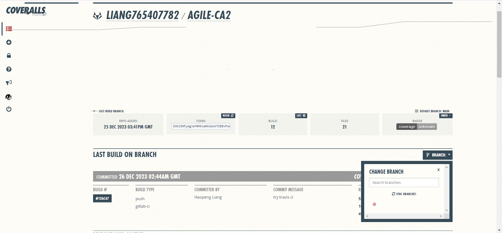
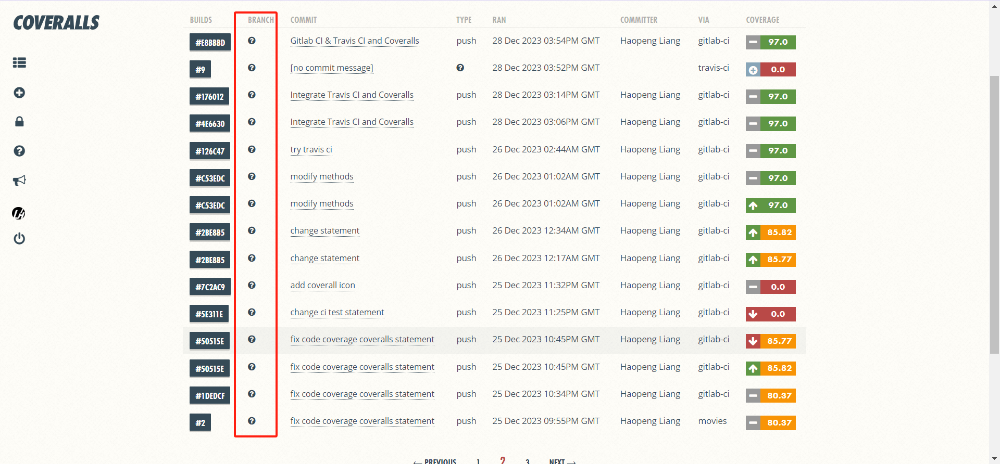
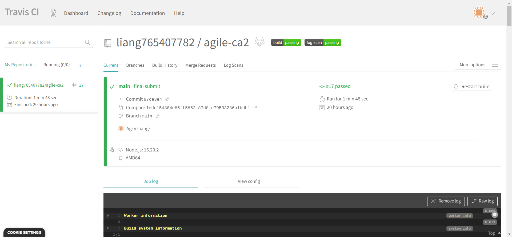
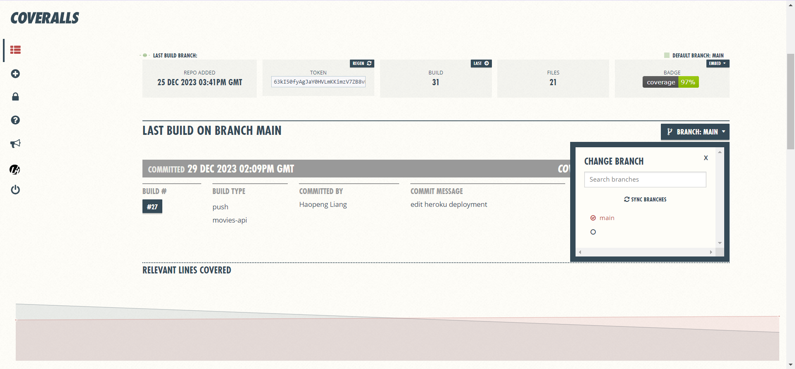
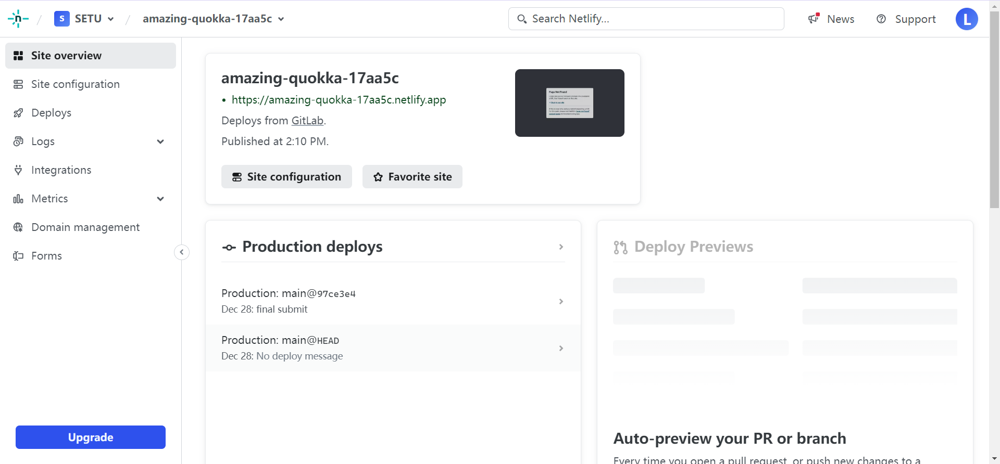
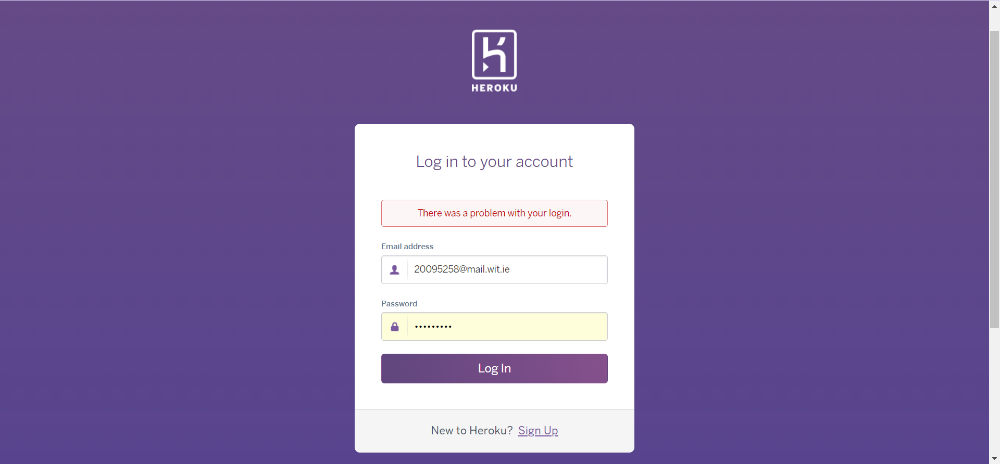
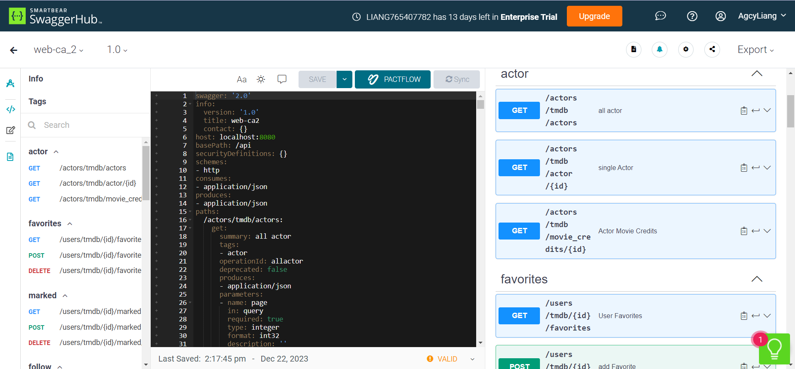

# Assignment 2 - Agile Software Practice.

[](https://coveralls.io/gitlab/liang765407782/agile-ca2?branch=)
[](https://app.travis-ci.com/liang765407782/agile-ca2)
[](https://app.netlify.com/sites/amazing-quokka-17aa5c/deploys?branch=develop)

Name: Haopeng Liang

## API endpoints.

Can visit the route here [SWAGGER HUB](https://app.swaggerhub.com/apis/LIANG765407782/web-ca_2/1.0)

movies:

+ GET `/api/movies/tmdb/movie/:id`: Retrieve the details of a specific movie from TMDB.
+ GET `/api/movies/tmdb/upcoming`: Retrieve a list of upcoming movies from TMDB.
+ GET `/api/movies/tmdb/trending`: Retrieve a list of movies from TMDB that have been trending upwards recently.
+ GET `/api/movies/tmdb/genres`: Retrieve all movie types from TMDB.
+ GET `/api/movies/tmdb/movie_credits/:id`: Retrieve the actors and actresses associated with the movie from TMDB.
+ GET `/api/movies/tmdb/movie/:id/image`: Retrieve pictures about the movie from TMDB.
+ GET `/api/movies/:id/reviews` : Retrieve the movie's reviews in the TMDB database.
+ GET `/api/movies/tmdb/home?page=xxx&language=xxx`: Fetch a list of movies from TMDB's Discover endpoint, starting at page n with a limit of m movies per page.

actors:

+ GET `/api/actors/tmdb/actors` : Retrieve the list of popular people from the TMDB database.
+ GET `/api/actors/tmdb/actors/:id` : Retrieve the actor's details from the TMDB database.
+ GET `/api/actors/tmdb/images/:id` : Retrieve the relevant image of the actor from the TMDB database.
+ GET `/api/actors/tmdb/movie_credits/:id` : Retrieve a list of movies associated with the actor from the TMDB database.

users:

+ POST `/api/users?action=register`: Register a new user. The required fields are typically username, email, and password.
+ POST `/api/users`: Authenticate a user, typically requiring account (username or email) and password fields.
+ POST `/api/users/tmdb/:id/favorites` (Auth): Add a movie to the user's list of favorites.
+ DELETE `/api/users/tmdb/:id/favorites/:movieId` (Auth): Remove a movie from the user's list of favorites.
+ GET `/api/users/tmdb/:id/favorites` (Auth): Retrieve a list of a user's favorite movies.
+ POST `/api/users/tmdb/:id/marked` (Auth): Mark a movie as a favorite for a specific user.
+ DELETE `/api/users/tmdb/:id/marked/:movieId` (Auth): Unmark a movie as a favorite for a specific user.
+ GET `/api/users/tmdb/:id/marked` (Auth): Retrieve a list of movies marked as favorites by a specific user.
+ POST `/api/users/tmdb/:id/follow` (Auth): Follow an actor, adding them to the user's list of followed actors.
+ DELETE `/api/users/tmdb/:id/follow/:actorId` (Auth): Unfollow an actor, removing them from the user's list of followed actors.
+ GET `/api/users/tmdb/:id/follow` (Auth): Retrieve a list of actors followed by a specific user.

reviews:

+ GET `/api/reviews/tmdb/all`: Fetch all reviews available in the database.
+ GET `/api/reviews/tmdb/user/:userId`(Auth): Get all reviews written by a specific user.
+ POST `/api/reviews/tmdb/:movieId`(Auth): Create a new review for a specific movie.
+ DELETE `/api/reviews/tmdb/:reviewId`(Auth): Delete a specific review by its ID.

## Automated Testing.

[In this section, include a listing of the response from running your tests locally (npm run test). Simply copy the output from your terminal and paste it into a fenced block (the triple tilda markup, i.e. ~~~ ), as shown below - do not use a screenshot.]

e.g. 

~~~
  Users endpoint
    GET /api/users/
database connected to test on ac-lykofio-shard-00-00.ljfob5w.mongodb.net
      √ should return a list of users
    User register endpoint
      POST /api/users/ - Registration Success Tests
        √ should successfully register a user with valid credentials (137ms)
      POST /api/users/ - Registration Boundary Tests
        √ should return error for missing required fields
        √ should return error for invalid email format (42ms)
      POST /api/users/ - Registration Failure Tests
        √ should return error for already existing username or email
    User login endpoint
      POST /api/users/ - Login Success Tests
        √ should login successfully with correct email (85ms)
        √ should login successfully with correct user name (87ms)
      POST /api/users/ - Login Boundary Tests
        √ should return error for missing account or password
      POST /api/users/ - Login Failure Tests
        √ should return error for incorrect credentials
    User profiles endpoint
      Favorite movies page
        Get user favorite movies
          GET /api/users/tmdb/:id/favorites - Success Tests
            √ should return favorite movies for a valid user ID (48ms)
          GET /api/users/tmdb/:id/favorites - Boundary Tests
            √ should return 403 Forbidden for accessing another user's favorites
          GET /api/users/tmdb/:id/favorites - Failure Tests
            √ should return 401 Unauthorized for invalid token
            √ should return 404 Not Found for non-existent user ID
        Add and delete favorites endpoint
          POST /api/users/tmdb/:id/favorites - Success Test
            √ should add a movie to favorites (54ms)
          DELETE /api/users/tmdb/:id/favorites/:movieId - Success Test
            √ should remove a movie from favorites (42ms)
          POST /api/users/tmdb/:id/favorites - Failure Test
            √ should not add a movie to favorites if user is unauthorized
          DELETE /api/users/tmdb/:id/favorites/:movieId - Failure Test
            √ should not remove a movie from favorites if user is unauthorized
      Marked movies page
        Get user marked movies
          GET /api/users/tmdb/:id/marked - Success Tests
            √ should return marked movies for a valid user ID (40ms)
          GET /api/users/tmdb/:id/marked - Failure Tests
            √ should return 401 Unauthorized for invalid token
            √ should return 404 Not Found for non-existent user ID
        Add and Delete marked movies
          POST /api/users/tmdb/:id/marked - Success Test
            √ should mark a movie successfully (52ms)
            √ should unmark a movie successfully (42ms)
          POST /api/users/tmdb/:id/marked - Failure Tests
            √ should return error for unauthorized access
            √ should return error for invalid user ID
      Followed actors page
        Get user followed actors
          GET /api/users/tmdb/:id/follow - Success Test
            √ should retrieve followed actors for a valid user ID (43ms)
          GET /api/users/tmdb/:id/follow - Failure Tests
            √ should return 401 Unauthorized for invalid token
            √ should return 404 Not Found for non-existent user ID
        Add and delete followed actors
          POST /api/users/tmdb/:id/follow - Success Test
            √ should follow an actor successfully (50ms)
            √ should unfollow an actor successfully (42ms)
          POST /api/users/tmdb/:id/follow - Failure Tests
            √ should return error for unauthorized access
            √ should return error for invalid user ID


  Movies endpoint
    GET /api/movies
      √ should return 20 movies and a status 200 (43ms)
    GET /api/movies/:id
      when the id is valid
        √ should return the matching movie
      when the id is invalid
        √ should return the NOT found message
    Discover movies endpoint
      Discover movies endpoint - Pass Tests
        √ should return movies and a status 200 (100ms)
      Discover movies endpoint - Boundary Tests
        √ should handle minimum valid page number (76ms)
        √ should return error for invalid page number
      Discover movies endpoint - Failure Tests
        √ should return error for invalid language code
        √ should return error when parameters are missing
    Single movie endpoint
      Single movie endpoint- Pass Test
        √ should return the matching movie (70ms)
      Single movie endpoint - Boundary Tests
        √ should return the movie for minimum valid ID (139ms)
        √ should return not found for a very large ID (154ms)
      Single movie endpoint - Failure Tests
        √ should return error for non-numeric ID
        √ should return error for negative ID
    Upcoming movie endpoint
      Upcoming movie endpoint - Success Tests
        √ should return upcoming movies for valid parameters (67ms)
      Upcoming movie endpoint - Boundary Tests
        √ should handle minimum valid page number (73ms)
        √ should return error for invalid page number
      Upcoming movie endpoint - Failure Tests
        √ should return error when parameters are missing
    Trending movie endpoint
      Trending movie endpoint - Success Tests
        √ should return trending movies for valid parameters (76ms)
      Trending movie endpoint - Boundary Tests
        √ should handle minimum valid page number (75ms)
        √ should return error for invalid page number
      Trending movie endpoint - Failure Tests
        √ should return error when parameters are missing
    Movie genres endpoint
      Movie genres endpoint - Success Tests
        √ should return movie genres for valid language (75ms)
      Movie genres endpoint - Boundary Tests
        √ should handle valid language code (80ms)
        √ should handle invalid language code (66ms)
      Movie genres endpoint - Failure Tests
        √ should return default genres when language is missing (73ms)
    Movie credits endpoint
      Movie credits endpoint - Success Tests
        √ should return movie credits for valid actor id (90ms)
      Movie credits endpoint - Boundary Tests
        √ should return error for non-numeric actor id
        √ should return error for negative actor id
      Movie credits endpoint - Failure Tests
        √ should return not found for non-existent actor id (146ms)
    Movie images endpoint
      Movie images endpoint - Success Tests
        √ should return movie images for valid movie id (68ms)
      Movie images endpoint - Boundary Tests
        √ should return error for non-numeric movie id
        √ should return error for negative movie id (142ms)
      Movie images endpoint - Failure Tests
        √ should return not found for non-existent movie id (140ms)
    Movies reviews endpoint
      Movies reviews endpoint - Success Tests
        √ should return movie reviews for valid movie id (71ms)
      Movies reviews endpoint - Boundary Tests
        √ should return error for non-numeric movie id
        √ should return error for negative movie id (145ms)
      Movies reviews endpoint - Failure Tests
        √ should return not found for non-existent movie id (153ms)


  Actors endpoint
    Stored Actor list endpoint
      Stored Actor list endpoint - Success Tests
        √ should return a list of actors for valid page and limit
      Stored Actor list endpoint - Boundary Tests
        √ should handle minimum valid page and limit
        √ should return error for invalid page and limit values
      Stored Actor list endpoint - Failure Tests
        √ should return default page and limit when parameters are missing
    Local single actor endpoint
      Local single actor endpoint - Success Tests
        √ should return details of an actor for valid actor id
      Local single actor endpoint - Boundary Tests
        √ should return error for non-numeric actor id
        √ should return error for negative actor id
      Local single actor endpoint - Failure Tests
        √ should return not found for non-existent actor id
    Popular actor endpoint
      GET /api/actors/tmdb/actors - Success Tests
        √ should return a list of popular actors for valid page and language (75ms)
      GET /api/actors/tmdb/actors - Boundary Tests
        √ should handle minimum valid page number (73ms)
        √ should return error for invalid page number
      GET /api/actors/tmdb/actors - Failure Tests
        √ should return error for invalid page format
    Single actor detail endpoint
      GET /api/actors/tmdb/actor/:id - Success Tests
        √ should return details of an actor for valid actor id (86ms)
      GET /api/actors/tmdb/actor/:id - Boundary Tests
        √ should return error for non-numeric actor id
        √ should return error for negative actor id
      GET /api/actors/tmdb/actor/:id - Failure Tests
        √ should return not found for non-existent actor id (150ms)
    Actor images endpoint
      GET /api/actors/tmdb/images/:id - Success Tests
        √ should return images of an actor for valid actor id (62ms)
      GET /api/actors/tmdb/images/:id - Boundary Tests
        √ should return error for non-numeric actor id
        √ should return error for negative actor id
      GET /api/actors/tmdb/images/:id - Failure Tests
        √ should return not found for non-existent actor id (154ms)
    Actor credits endpoint
      GET /api/actors/tmdb/movie_credits/:id - Success Tests
        √ should return movie credits of an actor for valid actor id and language (71ms)
      GET /api/actors/tmdb/movie_credits/:id - Boundary Tests
        √ should return error for non-numeric actor id
        √ should return error for negative actor id
      GET /api/actors/tmdb/movie_credits/:id - Failure Tests
        √ should return not found for non-existent actor id (150ms)


  Reviews endpoint
    Get all local user reviews
      GET /api/users/tmdb/all - Success Test
        √ should retrieve all reviews when they exist
      GET /api/users/tmdb/all - Failure Test
        √ should return 404 when no reviews are found
    My reviews page
      Get Single user reviews
        GET /api/reviews/tmdb/user/:userId - Success Test
          √ should retrieve all reviews for a valid user ID (49ms)
        GET /api/reviews/tmdb/user/:userId - Failure Test
          √ should return 404 when no reviews are found for a user
      Add user reviews
        POST /api/reviews/tmdb/:movieId - Success Test
          √ should create a review successfully (52ms)
        POST /api/reviews/tmdb/:movieId - Failure Test
          √ should return error for invalid review data (57ms)
      Delete user reviews
        DELETE /api/reviews/tmdb/:reviewId - Success Test
          √ should delete a review successfully (76ms)
        DELETE /api/reviews/tmdb/:reviewId - Failure Test
          √ should return error when review does not exist (48ms)


  100 passing (20s)

~~~

## Deployments.

staging

https://hpl-movies-api-58c402a06adc.herokuapp.com/api/movies

https://hpl-movies-api-58c402a06adc.herokuapp.com/api/users

production

https://hpl-movies-api-58c402a06adc.herokuapp.com/api/movies

https://hpl-movies-api-58c402a06adc.herokuapp.com/api/users

GitLab CI



## Independent Learning (if relevant)

Istanbul Generated Code Coverage Reports:

```
---------------------------------------|---------|----------|---------|---------|-------------------
File                                   | % Stmts | % Branch | % Funcs | % Lines | Uncovered Line #s 
---------------------------------------|---------|----------|---------|---------|-------------------
All files                              |   94.74 |    70.15 |    97.1 |   96.99 |                   
 agile-ca2                             |     100 |      100 |     100 |     100 |                   
  index.js                             |     100 |      100 |     100 |     100 |                   
 agile-ca2/api                         |   87.32 |    60.46 |   87.17 |   86.76 |                   
  tmdb-api.js                          |   87.32 |    60.46 |   87.17 |   86.76 | ...00,109,114,157 
 agile-ca2/api/actors                  |   96.85 |    81.18 |     100 |    94.8 |                   
  actorModel.js                        |     100 |      100 |     100 |     100 |                   
  index.js                             |   96.66 |     80.8 |     100 |   94.36 | 54,90,110,132     
 agile-ca2/api/movies                  |   97.76 |    84.12 |     100 |   97.14 |                   
  index.js                             |   97.67 |    83.87 |     100 |   96.96 | 75,142,161        
  movieModel.js                        |     100 |      100 |     100 |     100 |                   
 agile-ca2/api/reviews                 |   95.77 |    74.54 |     100 |     100 |                   
  index.js                             |   95.45 |    73.58 |     100 |     100 | 2,11-24,51        
  reviewModel.js                       |     100 |      100 |     100 |     100 |                   
 agile-ca2/api/users                   |   88.31 |    73.27 |   93.24 |    94.7 |                   
  index.js                             |   88.14 |    77.22 |   94.82 |    95.1 | 46-54,313         
  userModel.js                         |   89.47 |    54.05 |    87.5 |   92.59 | 17,29             
 agile-ca2/authenticate                |   81.39 |       55 |      70 |   83.87 |                   
  index.js                             |   81.39 |       55 |      70 |   83.87 | 16-21             
 agile-ca2/db                          |   83.33 |      100 |      50 |   81.81 |                   
  index.js                             |   83.33 |      100 |      50 |   81.81 | 11,14             
 agile-ca2/errHandler                  |      80 |       50 |     100 |      80 |                   
  index.js                             |      80 |       50 |     100 |      80 | 5                 
 agile-ca2/seedData                    |   95.23 |    54.16 |     100 |     100 |                   
  index.js                             |   94.54 |    52.17 |     100 |     100 | 2-50              
  movies.js                            |     100 |      100 |     100 |     100 |                   
  reviews.js                           |     100 |      100 |     100 |     100 |                   
  users.js                             |     100 |      100 |     100 |     100 |                   
 agile-ca2/tests/functional/api/actors |   98.41 |    51.51 |     100 |     100 |                   
  index.js                             |   98.41 |    51.51 |     100 |     100 | 2,22-30           
 agile-ca2/tests/functional/api/movies |    98.9 |    51.51 |     100 |     100 |                   
  index.js                             |    98.9 |    51.51 |     100 |     100 | 2,22-30           
 ...e-ca2/tests/functional/api/reviews |   97.97 |    61.36 |     100 |     100 |                   
  index.js                             |   97.97 |    61.36 |     100 |     100 | 2,26-91           
 agile-ca2/tests/functional/api/users  |   98.83 |    57.89 |     100 |     100 |                   
  index.js                             |   98.83 |    57.89 |     100 |     100 | 2,25-32           
---------------------------------------|---------|----------|---------|---------|-------------------
```

Coveralls code coverage: 

**Problems**: At first I used gitlab to connect to the coveralls repository and then used gitlab ci to run it to generate code coverage. Then there was a problem where coveralls couldn't find the branch committed by gitlab, resulting in the code coverage being generated but the badge showing unknown and the branch showing the question mark. I've tried many different methods commit more than 20 times, looked through many documents and blogs and still can't solve the problem.






**Travis CI**: Then I decided to use one of the most common methods on the web, which is to run coveralls statements with Travis CI to finally generate code coverage. At first, I was using GitHub for activating builds for Travis CI, but this didn't work after many tries. I ended up using a GitLab repository to interoperate with Travis CI, which worked on the first commit and was able to display code coverage and badges properly.






**Netlify**: This was due to an initial Heroku account lockout, which led to issues with not being able to log in or even register as well, and then the compelling need to switch to another online deployment method. For this, I tried a number of platforms, and finally decided to use Netlify, which requires only simple configuration to complete the deployment, and can also connect directly to the GitLab repository through the CI for updates and other operations. The downside of it is that it takes money to actually deploy it, or else there's no way to access the page I deployed over the public network. The pro is that I was able to get a badge for successful deployment, so I kept it.




**Heroku**: The problem is more serious here, with an inability to log in, then I wrote an email to Heroku's support and got their help, and was able to log in and access it properly after adding the double authentication.



.png)

.png)

**Swagger**: 在Web应用开发的作业中已经学习到了，通过postman保存路由的方式生成json文件，再通过网上的json转yml文件功能最后通过上传这个yml文件到Swagger Hub得到最后的路由展示


